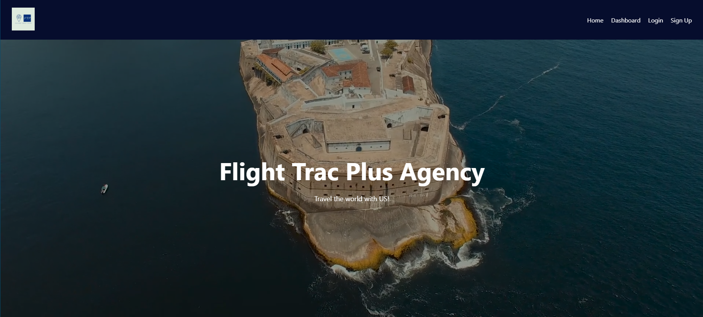
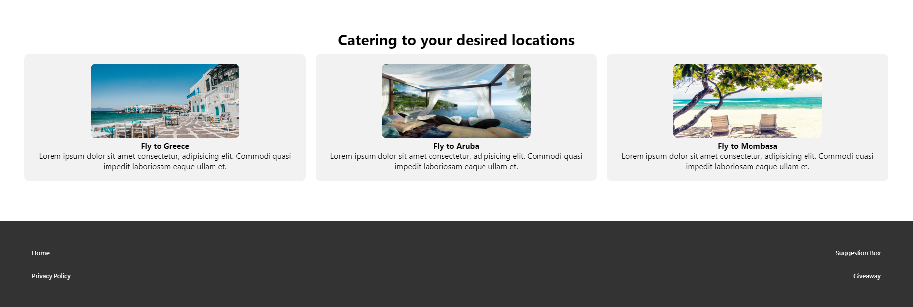
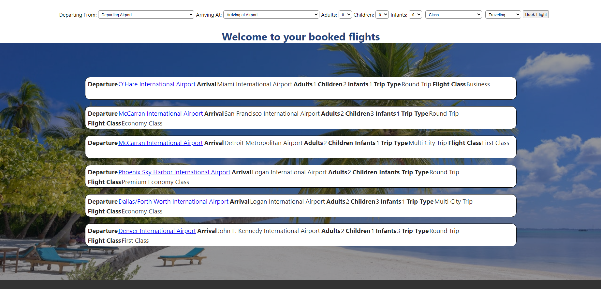
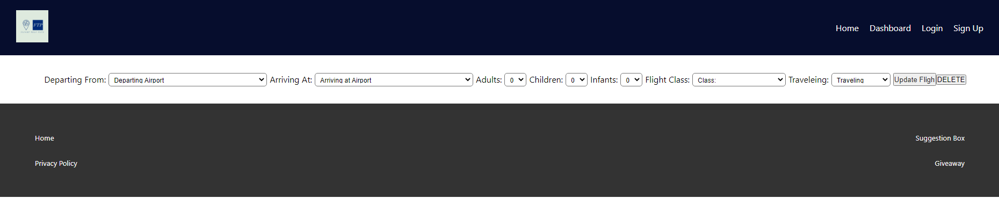
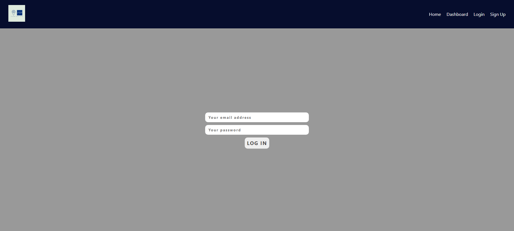
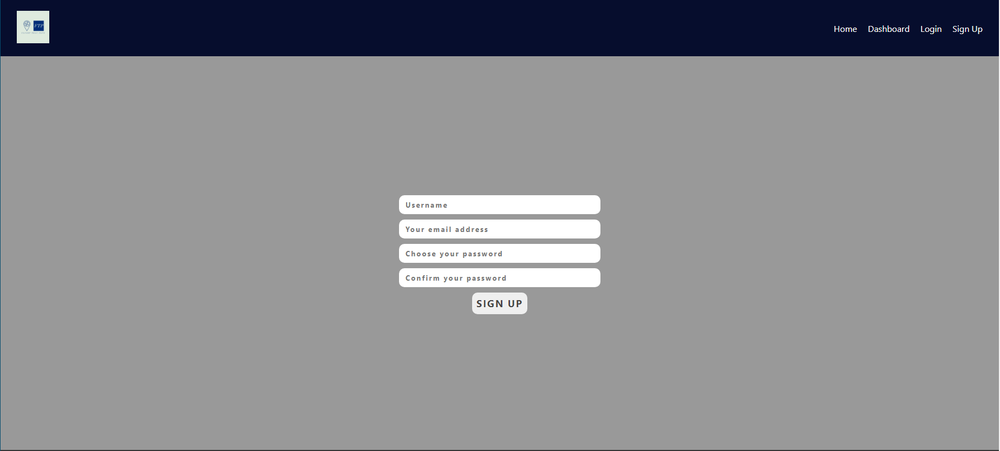

# Flight Trac Plus

### Flight Trac Plus Agency is a website where you can book flight reservations, hotel accommodations as well as events and restaurant reservations all in one place.

---

## Technologies used

- ### React Native
- ### Cascading Style Sheet(CSS)

- ### JavaScript

- ### Express

- ### NodeJS

- ### MONGODB

- ### Mongoose

## Screenshots

### Homepage - Header & Cater Section

## 

## 

### Dashboard

### 

### Edit/Delete Page

### 

### Login Page

### 

### Sign Up Page

### 

[Click here](https://flight-trac-plus.netlify.app/) to book your next vacation.

Run `npm install` to install necessary dependencies.

#### Future Enhancements

- Consume API's to get real-time data
- Be able to use Stripe as a payment system
- To implement hotel & car rentals
- To reserve event tickets and restaurant reservations for users
- Provide users a bundle price for a reduced price
